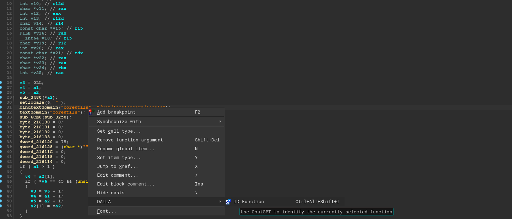

# DAILA 
Decompiler Artificial Intelligence Language Assistant - Built on OpenAI


## Installation
Clone down this repo and pip install and use the daila installer:
```bash
pip3 install -e . && daila --install 
```

Depending on your decompiler, this will attempt to copy the script files into your decompiler and install
the DAILA core to your current Python. If you are using Binja or IDA, make sure your Python is the same 
as the one you are using in your decompiler. 

If you are using Ghidra, you may be required to enable the `$USER_HOME/ghidra_scripts` as a valid 
scripts path. 

## Usage
In your decompiler you can access the DAILA options in one of two ways:
1. If you are not in Ghidra, you can right-click a function and go to `Plugins` or directly use the `DAILA ...` menu.
2. If you are in Ghidra, use `Tools->DAILA ...` when selected on a function

Currently, we only support `Function Identification`, which can also be activated with `Ctrl+Alt+Shift+I`.



## Features
### Function Identification
We use ChatGPT to attempt to:
1. Identify which open-source project this decompilation could be a result of 
2. Find a link to that said source if it exists 
