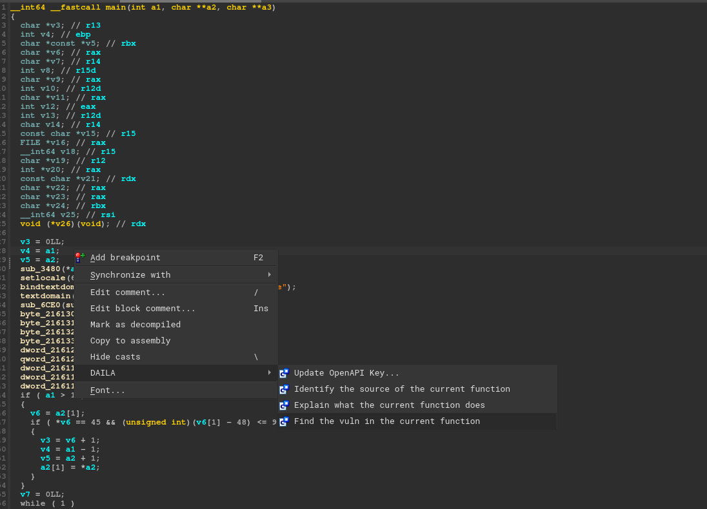

# DAILA 
The Decompiler Artificial Intelligence Language Assistant (DAILA) is a unified interface for AI systems to be used in decompilers.
Using DAILA, you can utilize various AI systems, like local and remote LLMs, all in the same scripting and GUI interfaces.


DAILA's main purpose is to provide a unified interface for AI systems to be used in decompilers.
To accomplish this, DAILA provides a lifted interface, relying on the BinSync library [LibBS](https://github.com/binsync/libbs) to abstract away the decompiler.
**All decompilers supported in LibBS are supported in DAILA, which currently includes IDA, Ghidra, Binja, and angr-management.**

## Installation
Install our library backend through pip and our decompiler plugin through our installer:
```bash
pip3 install dailalib && daila --install 
```

### Ghidra Extras
You need to do a few extra steps to get Ghidra working.
Next, enable the DAILA plugin:
1. Start Ghidra and open a binary
2. Goto the `Windows > Script Manager` menu
3. Search for `daila` and enable the script

You must have `python3` in your path for the Ghidra version to work. We quite literally call it from inside Python 2.
You may also need to enable the `$USER_HOME/ghidra_scripts` as a valid scripts path in Ghidra.

### Manual Install (if above fails)
If the above fails, you will need to manually install.
To manually install, first `pip3 install dailalib` on the repo, then copy the [daila_plugin.py](./dailalib/daila_plugin.py) file to your decompiler's plugin directory.


## Usage
DAILA is designed to be used in two ways:
1. As a decompiler plugin with a GUI
2. As a scripting library in your decompiler

### Decompiler GUI
With the exception of Ghidra (see below), when you start your decompiler you will have a new context menu 
which you can access when you right-click anywhere in a function:



If you are using Ghidra, go to `Tools->DAILA->Start DAILA Backend` to start the backend server.
After you've done this, you can use the context menu as shown above.

### Scripting
You can use DAILA in your own scripts by importing the `dailalib` package.
Here is an example using the OpenAI API:
```python
from dailalib import OpenAIAPI
from libbs.api import DecompilerInterface

deci = DecompilerInterface.discover_interface()
ai_api = OpenAIAPI(decompiler_interface=deci)
for function in deci.functions:
    summary = ai_api.summarize_function(function)
```


## Supported AI Backends
### OpenAI
DAILA supports the OpenAI API. To use the OpenAI API, you must have an OpenAI API key.
If your decompiler does not have access to the `OPENAI_API_KEY` environment variable, then you must use the decompiler option from
DAILA to set the API key.

Currently, DAILA supports the following prompts:
- Summarize a function
- Rename variables
- Rename function
- Identify the source of a function

## Supported Decompilers
- IDA


- Binja


- Ghidra
