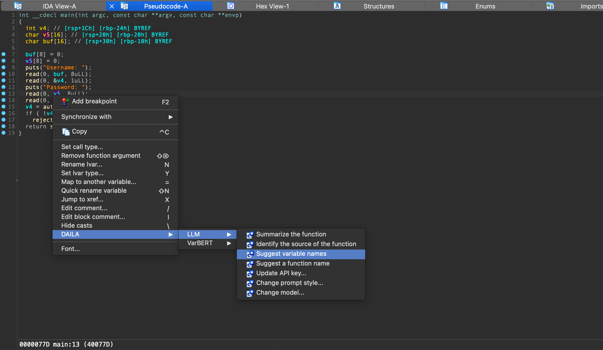
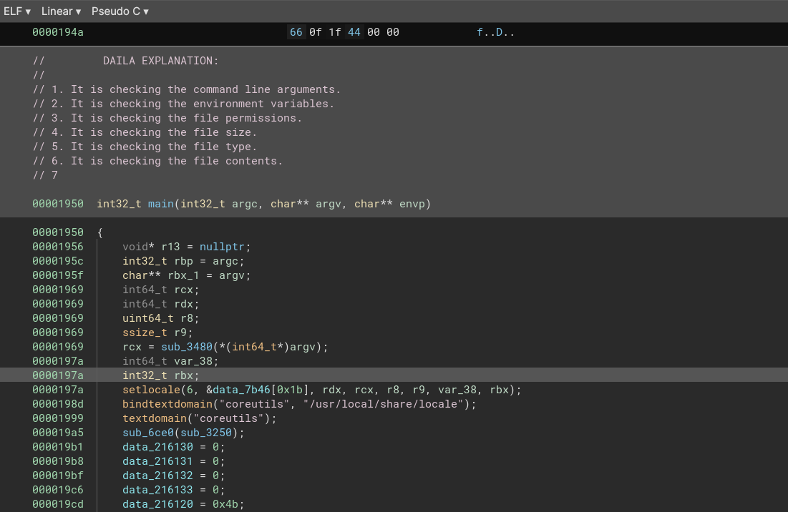
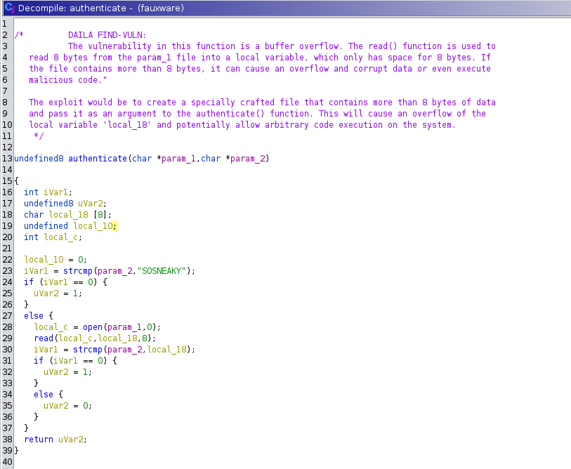
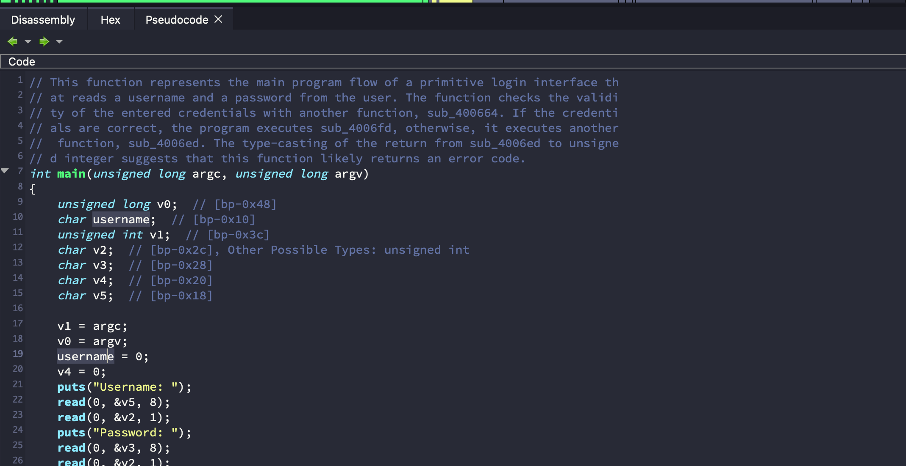

# DAILA 
The Decompiler Artificial Intelligence Language Assistant (DAILA) is a unified interface for AI systems to be used in decompilers.
Using DAILA, you can utilize various AI systems, like local and remote LLMs, all in the same scripting and GUI interfaces across many decompilers.
DAILA was featured in the keynote talk at [HITCON CMT 2023](https://youtu.be/HbrebQiFLDs?si=TJhKSju85jTLSsiT). 



**Join our discord below for more online help** (hosted on the BinSync server):

[](https://discord.gg/wZSCeXnEvR)


## Supported Decompilers and AI Systems
DAILA interacts with the decompiler abstractly through the [LibBS](https://github.com/binsync/libbs) library.
This allows DAILA to support the following decompilers:
- IDA Pro: **>= 8.4**
- Ghidra: **>= 11.1**
- Binary Ninja: **>= 2.4**
- angr-management: **>= 9.0**

DAILA supports any LLM supported in [LiteLLM](https://github.com/BerriAI/litellm), such as:
- ChatGPT
- Claude
- Llama2
- Gemini
- and more...

DAILA also supports local models of different types, like [VarBERT](https://github.com/binsync/varbert_api), a local model for renaming variables in decompilation published in S&P 2024.

## Installation
Install our library backend through pip and our decompiler plugin through our installer:
```bash
pip3 install dailalib && daila --install 
```

This is the light mode. **If you want to use VarBERT, you must install the full version**:
```bash
pip3 install 'dailalib[full]' && daila --install 
```

This will also download the VarBERT models for you through the [VarBERT API](https://github.com/binsync/varbert_api).
If you happen to be installing DAILA on a machine that won't have internet access, like a secure network, you can use our Docker image in the [Docker Container](#docker-container) section.

### Ghidra Extra Steps
You need to do a few extra steps to get Ghidra working.
Next, enable the DAILA plugin:
1. Start Ghidra and open a binary
2. Goto the `Windows > Script Manager` menu
3. Search for `daila` and enable the script

You must have `python3` in your path for the Ghidra version to work. We quite literally call it from inside Python 2.
You may also need to enable the `$USER_HOME/ghidra_scripts` as a valid scripts path in Ghidra.

### Manual Install (if above fails)
If the above fails, you will need to manually install.
To manually install, first `pip3 install dailalib` on the repo, then copy the [daila_plugin.py](./dailalib/daila_plugin.py) file to your decompiler's plugin directory.


## Usage
DAILA is designed to be used in two ways:
1. As a decompiler plugin with a GUI
2. As a scripting library in your decompiler

### Decompiler GUI
With the exception of Ghidra (see below), when you start your decompiler you will have a new context menu 
which you can access when you right-click anywhere in a function:


If you are using Ghidra, go to `Tools->DAILA->Start DAILA Backend` to start the backend server.
After you've done this, you can use the context menu as shown above.

### Scripting
You can use DAILA in your own scripts by importing the `dailalib` package.
Here is an example using the OpenAI API:

```python
from dailalib import LiteLLMAIAPI
from libbs.api import DecompilerInterface

deci = DecompilerInterface.discover()
ai_api = LiteLLMAIAPI(decompiler_interface=deci)
for function in deci.functions:
    summary = ai_api.summarize_function(function)
```

### Docker Container
If you are attempting to install DAILA for a one-shot install that will not use the internet after install, like on a secure network, you can use our Docker container.
You should either build the container yourself, save the image to a tarball, and then load it on the target machine, or you can use our pre-built image.
You can build the container yourself by running `docker build -t daila .` in the root of this repo.
You can also download our pre-built image by running `docker pull binsync/daila:latest` (the image is for x86_64 Linux).
The container contains DAILA and a copy of Ghidra.

Now you need to foward X11 to the container so that you can see the GUI.
To do this, you need to run the container with the following flags:
```bash
docker run -it --rm -e DISPLAY=$DISPLAY -v /tmp/.X11-unix:/tmp/.X11-unix binsync/daila:latest
```

In the container, you can launch ghidra from `/tools/ghidra_10.4_PUBLIC/ghidraRun`.
Now follow the [Ghidra Extra Steps](#ghidra-extra-steps) to enable the DAILA plugin and you're good to go!

## Supported AI Backends
### LiteLLM (many backends)
DAILA supports the LiteLLM API, which in turn supports various backends like OpenAI. 
To use a commercial LLM API, you must provide your own API key.
As an example, to use the OpenAI API, you must have an OpenAI API key.
If your decompiler does not have access to the `OPENAI_API_KEY` environment variable, then you must use the decompiler option from
DAILA to set the API key.

In `Settings`, you can also add/use any OpenAI-based LLM endpoint, like using Llama2.

Currently, DAILA supports the following prompts:
- Summarize a function
- Rename variables
- Rename function
- Identify the source of a function
- Find potential vulnerabilities in a function
- Summarize the man page of a library call
- Free prompting... just type in your own prompt!

### VarBERT
VarBERT is a local BERT model from the S&P 2024 paper [""Len or index or count, anything but v1": Predicting Variable Names in Decompilation Output with Transfer Learning"]().
VarBERT is for renaming variables (both stack, register, and arguments) in decompilation.
To understand how to use VarBERT as a library, please see the [VarBERT API](https://github.com/binsync/varbert_api) documentation.
Using it in DAILA is a simple as using the GUI context-menu when clicking on a function. 

## Demo
You can find a demo of VarBERT running inside DAILA below:

[](https://youtu.be/nUazQm8sFL8 "DAILA v2.1.4: Renaming variables with local VarBERT model")


## Supported Decompilers
- IDA


- Binja


- Ghidra


- angr management

